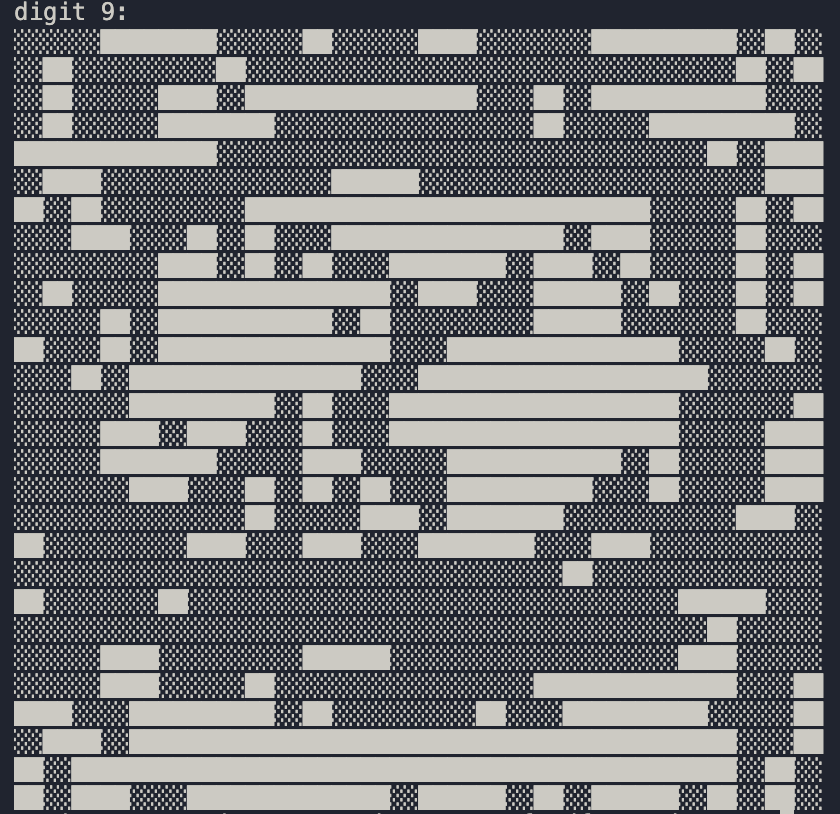
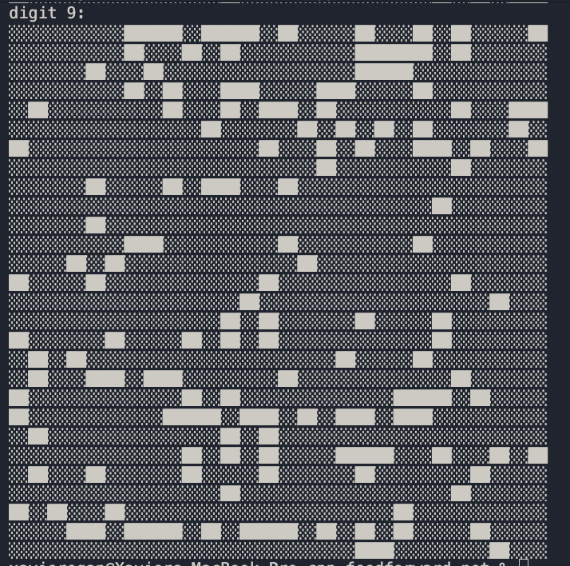

# Image Generation
## Goal
Get a ffnn with my library to produce an image in the same size and style of MNIST from an input vector of 10 inputs, with one being 1 and the rest being 0.
Example:
input: [0, 0, 1, 0, 0, 0, 0, 0, 0, 0]
output: image of 2 in 28 x 28 space.

## Background
This document will document my process for producing an ai model to perform this task.

### Terminology
"an input of 3" = [0, 0, 0, 1, 0, 0, 0, 0, 0, 0]

## Idea 1:
Two models, MNIST predictor and Image generator (M and G).
G generates an image with an input of n, M predicts the number.
Backprop gets run backwards through M to G on the difference between the predicted number and the input.

### Expected problems
There is nothing encouraging G to generate coherent images, it will likely learn seemingly random jibberish that happens to strongly activate the predictor towards the answer.

### Results
As expected, we get random jibberish.

this does not look like a 9 at all!

## Idea 2:
Same as Idea 1
but train another small model to distinguish jibberish from not, 
training data for it is the mnist images and random noise. Random noise gets labeled 0, mnist images get labeled 1.

Then use this to train the M to output [0.1, 0.1, ...] for anything that looks like gibberish

TRAIN jibberish model to predict if an image is a valid digit, or noise/jibberish.

MAIN LOOP:
    MAKE a batch of one hot vectors with slight noise added

    FORWARD through the image generator (generates a bunch of images)
    FORWARD the result through the MNIST predictor
    BACKWARDS through MNIST predictor
    BACKWARDS through the image generator using gradients from the MNIST predictor
    OPTIMISE the image generator (NOT the MNIST predictor)

    FORWARD generated images through jibberish model
    FORWARD generated images through MNIST predictor
    BACKWARDS through MNIST predictor with jibberish model outputs as the label
    OPTIMISE MNIST predictor

### Expected problems
Because im training M to output [0.1, 0.1, ...] on random noise, model performance may degrade.
image generator may still find way to hack the adversary

### Result

